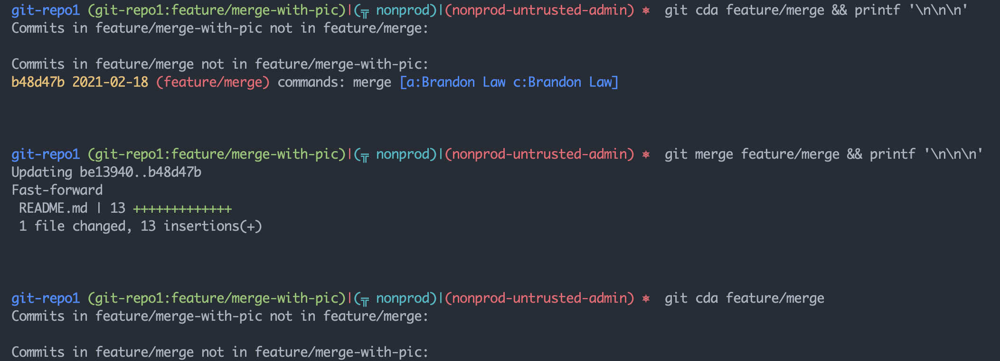

# How to git

## Commands to cover:
* [clone](#clone)
* [checkout](#checkout)
* [fetch](#fetch)
* [pull](#pull)
* [merge](#merge)

###  clone

* What does it do?
    * Obviously - it downloads the repo onto my computer
    * Not so obvious - it sets up the remote for us

###  checkout

* What do we use it for?
    * checking out new branches from an existing branch
        * `git checkout -b feature/123`
    * checking out a specific file or folder from a different branch / commit
        * `git checkout origin/development file1.txt # branch`
        * `git checkout head^ # commit `
        * `git checkout -- file1.txt # assumes HEAD - but allows for deleted files`

###  fetch

* What does it do?
    * fetch updates what your copy of the repo knows about the remote
    * fetch **does not** change any files on your computer
    * fetch _does_ change what your `origin` ( or other remote ) looks like

* When should I use fetch?
    * When you want to see if there are new changes
    * When you aren't sure if there are new changes
    * When someone says 'Hey, you should fetch'
    * All the time, any time

###  pull

Pull is a short-cut of `fetch` to update the remote and `merge` remote's state to local branch

###  merge

Merge takes 2 different branches ( or hashes ) and merges the histories together

> The output will be that it also merges the files together and can cause "merge conflicts"

What's a merge conflict
 - Merge conflicts happen when git can't figure out what to do with file changes between 2 commits.  This happens when 2 separate commits change a file in the same location.
 - The question is "Which change, or combination of changes, should be the end result of these 2 commits?
 - Sometimes a single person can understand what the result should be
 - Sometimes 2 or more should sit together to achieve desired result of the 2 commits

Examples:

